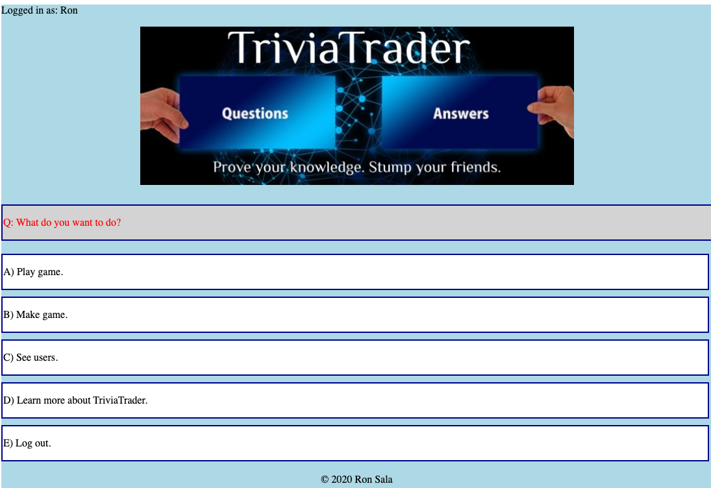

# Makefile 005: JavaScript Project--Reuseable Functions for Adding HTML Elements Dynamically

*“We will encourage you to develop the three great virtues of a programmer: laziness, impatience, and hubris.”--Larry Wall*



## Overview

My latest app is a game called [TriviaTrader](https://github.com/ronsala/trivia-trader-backend) that includes a Rails API backend and vanilla JS frontend.

While working on the project, I began reading about pitfalls of manipulating the DOM using the innerHTML property, including slow performance and Cross-site Scripting vulnerabilities. (See https://www.geeksforgeeks.org/what-is-the-disadvantage-of-using-innerhtml-in-javascript/ for more details.)

I wanted practice avoiding such issues by creating HTML elements dynamically with JavaScript. I also wanted to exemplify Perl inventor Larry Wall's famous virtues--laziness, impatience, and hubris--by having some workhorse functions that could be reused to automagically render HTML depending on arguments passed in, without the trouble of building HTML snippets from scratch each time.

## `renderMiddleBox()`
One of these functions is called `renderMiddleBox()`, which creates a formatted text box:

```
*App.js*

  static renderMiddleBox(id, text) {
    let boxId = `box_${id}`;
    window[boxId] = document.createElement('div');
    window[boxId].className = 'box-middle';
    window[boxId].id = boxId;
    let boxP = document.createElement('p');
    let pID = `${boxId}_p`;
    boxP.id = pID;
    boxP.textContent = text;
    window[boxId].appendChild(boxP);
    let boxes = document.getElementById('boxes');
    boxes.append(window[boxId]);
  }
```

Because this is a class method in my App class, I've included the keyword `static`. I can call it from any of the other classes in my app with `App.renderMiddleBox()`. It takes an id for the element being created (to which `box_` is prepended) and the text to appear in a paragraph inside it. The paragraph is appended to the box, which is in turn appended to a set of boxes with the id `boxes`.

This method is called 33 times in the app.

## `setAttributes()`

Another reusable method in the app is `setAttributes()`, based on JavaScript's [Element.setAttribute()](https://developer.mozilla.org/en-US/docs/Web/API/Element/setAttribute):

```
*app.js*

  static setAttributes(el, attrs) {
    for(let key in attrs) {
      el.setAttribute(key, attrs[key]);
    }
  }
```

It takes an HTML element and an object containing attributes for that object as keys and their corresponding values.

This method is called 29 times in the app.

## Example Use

An example using both these methods is in creating a set of radio buttons allowing the user to select a category for their game from the list of categories in the database:

```
*game.js*

    App.renderMiddleBox('category', "Q: What is your game's category?");

    fetch('http://localhost:3000/api/v1/categories')
    .then(response => response.json())
    .then(categories => {
      categories.data.forEach(category => {
        let newCategory = new Category(category, category.attributes);
        let catButton = document.createElement('input');
        App.setAttributes(catButton, {
          'id': newCategory.id,
          'type': 'radio',
          'name': 'category',
          'value': newCategory.id,
        });
        let label = document.createElement('label');
        label.htmlFor = newCategory.id;
        let desc = document.createTextNode(newCategory.name);
        label.append(desc);
        window.box_category.append(label);
        label.insertAdjacentElement('afterend', catButton);
        let br = document.createElement('br');
        window.box_category.append(br);
      });
    });

```

I call App.renderMiddleBox() to create a box with an id of `box_category` and the text `Q: What is your game's category?`.

Then, I fetch the categories list from the database and iterate over it to instantiate new frontend Categories, assigning each in turn to a loop variable, `newCategory`. On each iteration, I create an input called `catButton` to use as the `el` argument to setAttributes(). For the `attrs` argument, I pass key-value pairs for `id`, `type`, `name`, and `value`.

Later in the loop, `catButton` gets a description label derived from `newCategory`'s name attribute.

When all is done, we have a dynamically created set of elements to append to the window:

```
<div class="box-middle" id="box_category">
  <p id="box_category_p">Q: What is your game's category?</p>
  <label for="36">Arts &amp; Entertainment</label>
  <input id="36" type="radio" name="category" value="36">
  <br>
  <label for="37">Games &amp; Sports</label>
  <input id="37" type="radio" name="category" value="37">
  <br>
  <label for="38">History</label>
  <input id="38" type="radio" name="category" value="38">
  <br>
  <label for="39">Science &amp; Tech</label>
  <input id="39" type="radio" name="category" value="39">
  <br>
  <label for="40">Hodge Podge</label>
  <input id="40" type="radio" name="category" value="40">
  <br>
</div>
```

